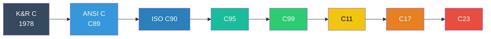
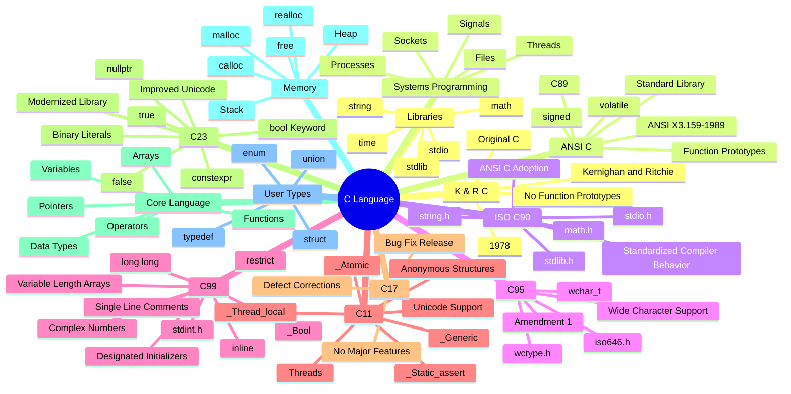

    

        
    

# **`Awesome`** C [Style](https://wikipedia.org/wiki/Programming_style) Guide 
[**`ANSI C`**](https://wikipedia.org/wiki/ANSI_C) | [**`C99`**](https://wikipedia.org/wiki/C99) | [**`C11`**](https://wikipedia.org/wiki/C11_(C_standard_revision)) | [**`C17`**](https://wikipedia.org/wiki/C17_(C_standard_revision)) | [**`C23`**](https://wikipedia.org/wiki/C23_(C_standard_revision))

 

    
    &nbsp;
    
    &nbsp;
    
    

## 📖 Contents
- [List of C Coding Guide](#list-of-c-coding-guide)
- [My Other Awesome Lists](#my-other-awesome-lists)
- [Contributing](#contributing)
- [Contributors](#contributors)

### List of C Coding Guide
- [C Style Guidelines](https://www.cs.umd.edu/~nelson/classes/resources/cstyleguide/)
- [C Coding Standard](https://users.ece.cmu.edu/~eno/coding/CCodingStandard.html)
- [Linux kernel coding style](https://www.kernel.org/doc/html/v4.10/process/coding-style.html)

## 

### My Other Awesome Lists
You can access the my other awesome lists [here](https://cyberthreatdefence.com/my_awesome_lists)

### Contributing
[Contributions of any kind welcome, just follow the guidelines](contributing.md)!

### Contributors
[Thanks goes to these contributors](https://github.com/cybersecurity-dev/awesome-c-style-guide/graphs/contributors)!

[🔼 Back to top](#awesome-c-style-guide-)
